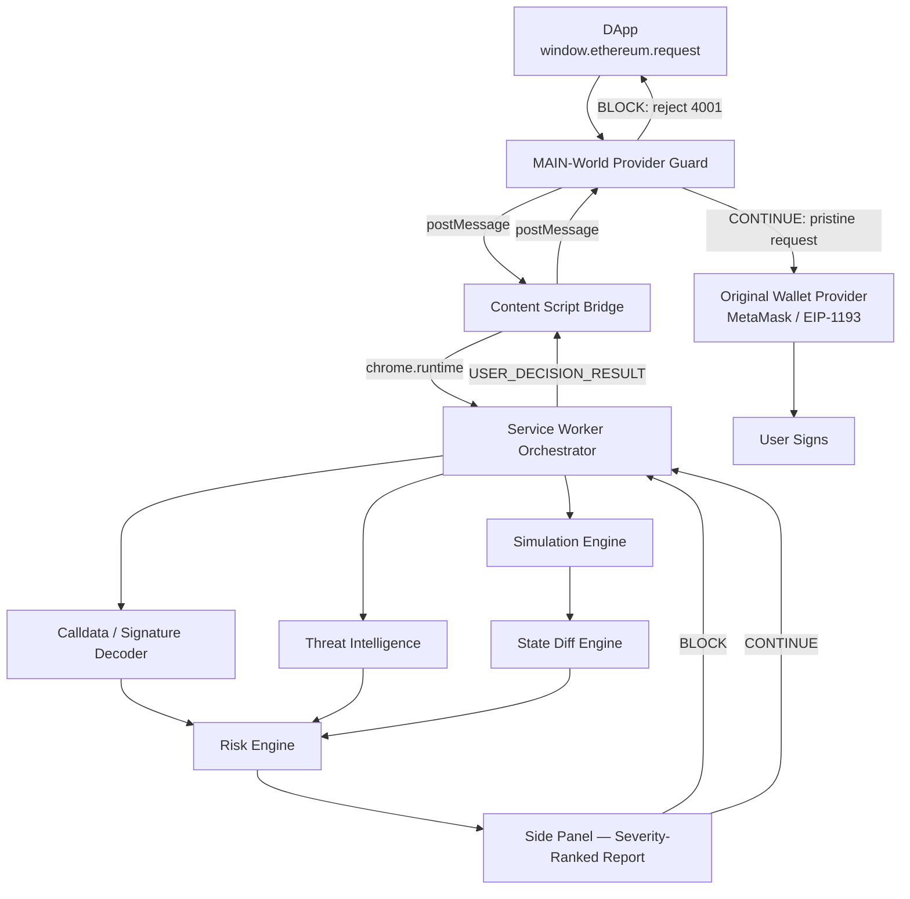
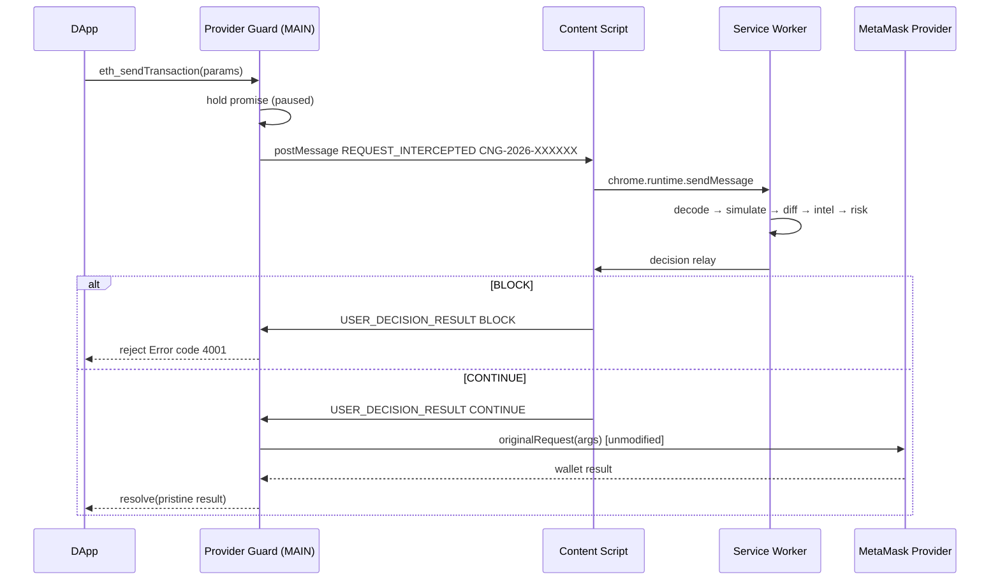
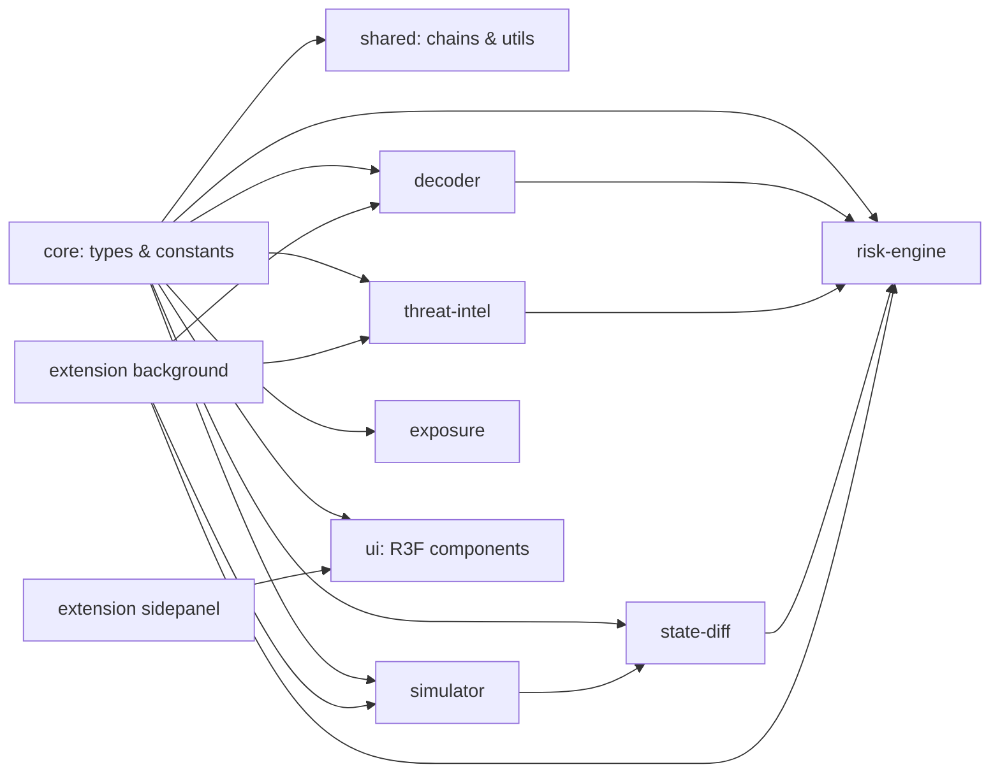

# Cognitia Shield — Architecture

## System overview



## Interception layer



## Package dependency graph



## Request lifecycle

```
REQUEST_RECEIVED → REQUEST_PAUSED → REQUEST_ANALYZING → REQUEST_SIMULATING
→ REQUEST_RISK_ASSESSMENT → USER_DECISION → REQUEST_BLOCKED | REQUEST_FORWARDING
→ REQUEST_COMPLETED | REQUEST_FAILED
```

Each UI stepper state corresponds to an actual async stage in the service worker.

## Analysis pipeline detail

1. **Normalize** — `eth_sendTransaction` becomes a `TransactionRequest`; signing methods become a
   `SignatureRequest` (never assume every request is a transaction).
2. **Decode** — selector lookup in the extensible selector DB; ERC-20/721/1155, multicall,
   permit recognition; unknown selectors surface `UNKNOWN FUNCTION` with the human explanation.
3. **Simulate** — `DemoSimulationEngine` (seeded) or `RealRpcSimulationEngine` (`eth_call`,
   `eth_estimateGas`; `debug_traceCall`/fork planned). Never broadcasts.
4. **Diff** — native/ERC-20/ERC-721 balance, allowance, operator, and ownership deltas.
5. **Intel** — address/selector matching against the modular threat DB.
6. **Risk** — deterministic rules produce findings with explicit score contributions; total is
   clamped to 0–100 and banded LOW/MEDIUM/HIGH/CRITICAL.

## Security invariants

- Original provider preserved (`__cognitiaOriginalRequest`); request payload forwarded unmodified.
- No private keys, seed phrases, or signing secrets requested, stored, or transmitted.
- The extension never auto-signs, never broadcasts simulated transactions.
- Dark-web/exposure intelligence is simulated and badged; a `RealThreatRelay` interface exists
  for legitimate live feeds only.
- Fail-safe: unsupported methods pass through untouched; a 10-minute pending timeout rejects
  hung requests with code 4001.
